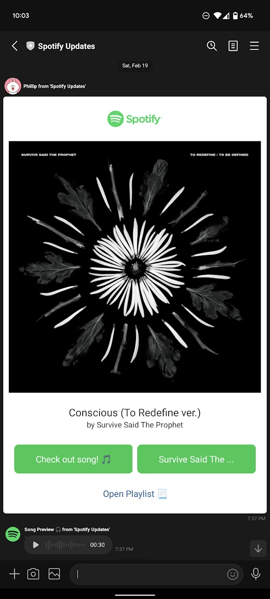
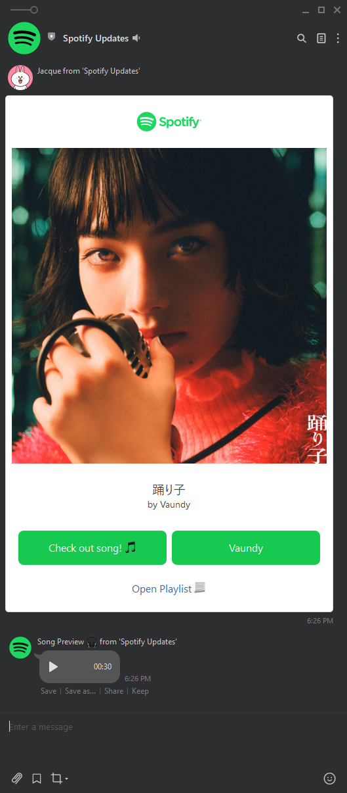
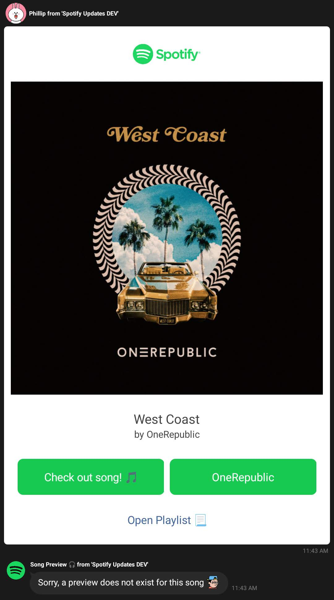

# spotify2line

spotify2line is a LINE message bot channel that will send updates when a new song is added into a collaborative playlist.

Currently, Spotify has implemented collaborative playlists, which allow multiple users to add songs to a single shared playlist. However, there is no existing notification system in place when someone adds a song. The motivation to create spotify2line was to solve this problem and create a way to send notification updates to a LINE chat when a new song has been added.


## Screenshot

| Description                           | Demo Image    |
| :-----------------------------------: |:-------------:|
| Mobile LINE app                       |  |
| Desktop LINE app                      |  |
| If there is no song preview available |  |


## Getting Started

### Pre-requisites
- [x] Spotify account 
- [x] LINE account

### Installation
1. Clone this project
    ```console
    git clone https://github.com/philliplam8/spotify2line.git
    ```
2. Use the package manager [npm](https://www.npmjs.com/) to install the following dependencies
    ```console
    npm install @line/bot-sdk express cors cookie-parser request fs dotenv cloudinary
    ```
3. Follow steps in the [Usage](#Usage) section below to host and use the spotify2line app

### Usage
This project will use the following APIs and free services to run and host the spotify2line application
- [Spotify Web API](https://developer.spotify.com/documentation/web-api/reference/#/)
- [LINE Messaging API](https://developers.line.biz/en/services/messaging-api/)
- [Heroku](https://www.heroku.com/)
- [Cloudinary](https://cloudinary.com/)
- [FreshPing](https://app.freshping.io/)

#### 1. Environment Variables File
> ***IMPORTANT:*** *Ensure the .env file is not made available to the public i.e. not uploaded to a public repository (to workaround this, use a .gitignore file). Your tokens and secrets should be kept hidden and treated like a password as they can be misused. If they are compromised, re-issue a new token/secret from the application accordingly.*
1. Create an environments variable file called `.env` in the root directory of the project
2. Copy and paste the following into the `.env` file
    ```.env
    # LINE
    CHANNEL_ACCESS_TOKEN=''
    CHANNEL_SECRET=''

    # SPOTIFY
    SPOTIFY_CLIENT_ID=''
    SPOTIFY_CLIENT_SECRET=''
    PLAYLIST_ID = ''

    # CLOUDINARY
    CLOUDINARY_CLOUD_NAME=
    CLOUDINARY_API_KEY=
    CLOUDINARY_API_SECRET=
    ```
3. In the following steps, we will be adding several environment variables into this file

#### 2. Create a new Spotify Developer App and Generate Client ID & Client Secret
1. Log into [Spotify Developer Dashboard](https://developer.spotify.com/dashboard/) with your existing Spotify account
2. Click *Create An App*
3. Fill in all required details and create a new Spotify Developer App
4. Copy the *Client ID* and *Client Secret* from the Dashboard Overview page and paste into the `.env` file

#### 3. Determine Spotify Playlist ID
1. Open your desired Spotify Playlist
2. Right-click on the playlist
3. Click `Share > Copy link to playlist`
4. Paste the share link into any text editor
5. The share link will appear with the following syntax `https://open.spotify.com/playlist/{playlistId}?si=`
6. Copy the `playlistId` value and paste it into the `.env` file 

#### 4. Create a new LINE Channel and Generate Channel Access Token & Channel Secret
1. Visit the [LINE Developers Messaging API](https://developers.line.biz/en/services/messaging-api/) page 
2. Click *Start now*
3. Login with your existing LINE account
4. Create a new channel
5. Copy the *Channel Secret* and *Channel Acccess Token* from the Dashboard Overview page and paste into the `.env` file
6. Save the `.env` file

#### 5. Create a new Heroku app and deploy app
> _Heroku is used here, but feel free to use any hosting method (local, AWS, etc.)_
1. Visit [Heroku](https://id.heroku.com/login) and create a new account (or sign in with an existing account)
2. Click *New > Create new app*
3. Following the instructions to *Deploy using Heroku Git*
4. Visit the *Settings Tab*
5. Click on *Reveal Config Vars*
6. Copy and paste all key/values from the `.env` file into the Heroku Config Vars section
7. Click on *More > View Logs* and ensure the app has been deployed successfully

#### 6. Setup Cloudinary Add-On
1. Visit the [Heroku Dashboard](https://dashboard.heroku.com/apps) and click on the created app
2. Proceed to the Overview Tab > Configure Add-ons
3. Search for *Cloudinary* and add the Free Tier plan
4. Click on the added *Cloudinary Add On* to visit the Cloudinary Console
5. In section *Configure your SDK*, click *Start configuring* > Node.JS
6. Copy and paste all key values from the `.env` file into the Heroku Config Vars section

#### 7. Setup FreshPing to periodically ping Heroku app
1. Visit [Freshping](https://app.freshping.io/) and create a new account (or sign in with an existing account)
2. Click *+ Add Check*
3. Enter the Heroku app URL into the *Check URL* field
4. Set *Check interval = 1 min*
5. Click *Save*

#### 8. Add LINE Channel
1. Visit [Line Manager](https://manager.line.biz/) 
2. Click on the Channel created
3. Click on *Gain Friends > "Add friend" tools"*
4. Click on *Create a URL*
5. Visit the URL and add the LINE channel on either desktop or mobile

#### 9. Add song to designated Spotify playlist
1. Congratulations, you are done! A LINE chat message will automatically send a broadcast message!


## License
spotify2line is licensed under the [MIT license](https://github.com/philliplam8/spotify2line/blob/main/LICENSE.txt)